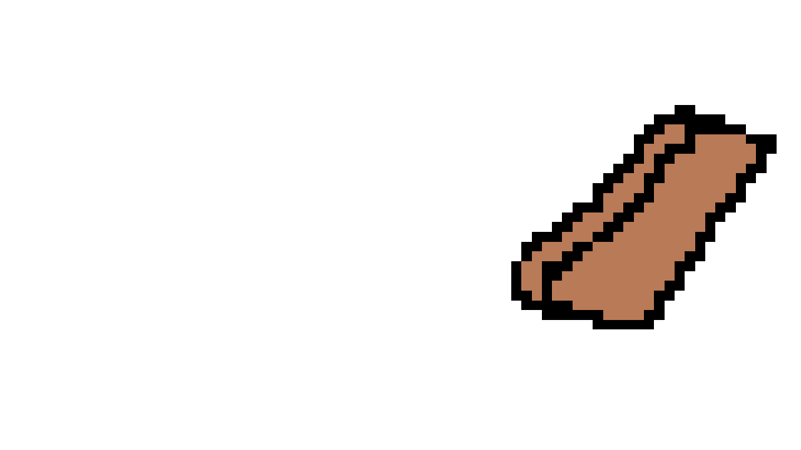
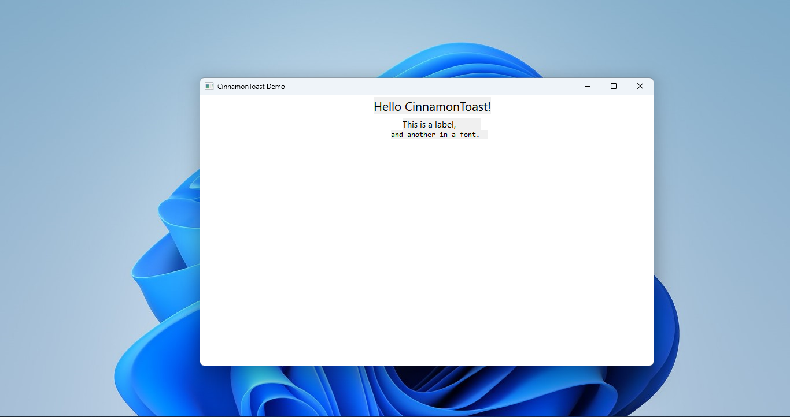

# Project "CinnamonToast"
Project CinnamonToast (as referred by it's codename) is a project that creates a cross-platform UI framework that's fast, modern and easy to work with. It's based on .xml and shared library files, separating the declaration from the definition. as well as an IDE (CinnamonToast IDE) written in .NET. 
Since the codebase is all written in C++, for a more user-friendly approach, we'll be using a custom IDE with support for drag-and-drop elements (like Visual Studio Designer) and also support for Lua, as an external library though this may add extra overhead to the codebase.

Currently, since its a very early project, there are still a TON of problems (like memory leaks, performance issues or UI issues) that will be addressed in the future.

## Creating a program
To create a simple GUI, you can directly modify the .xml files, but you can use the IDE for convenience.

Example:
```xml
<!-- xml file -->
<root version="1" uiVersion="1.0.0">
    <window title="Program" width="800" height="500" bgColor="systemDefault" id="mainWindow">
      <!-- Lua main file location for the implementation -->
      <library type="lua" location="main.lua"/>

      <!-- Alternatively, you can use direct .dlls (this may require some C++ programming)
      <library location="main.dll">
      -->

      <label x="330" y="60" font="Segoe UI" fontSize="16" id="label1">Hello, world!</label>
    </window>
</root>
```

For the implementation (written in Lua), insert:
```lua
-- main.lua
function onInit()
    print("Loaded!")
    local label = CinnamonToast.getComponentById("label1")
    print(label.getText())
end

CinnamonToast.registerEvent("start", onInit);
```

or you can directly use C++ (faster, but more complicated):
```cpp
#include <CToastAPI.h> // CinnamonToast API
#include <string>
#include <iostream>
#include <windows.h>
extern "C" __declspec(dllexport) void CToastMain(CinnamonToast::CToastAPI* api) {
    std::cout << "Loaded!" << std::endl;
    CinnamonToast::ComponentId id = api->GetComponentById("label1");
    const char* string = api->GetComponentText(id);
    std::cout << string << std::endl;
};
```

## Building
To build CinnamonToast, you need CMake and a C++ compiler (like MSVC, or g++). Then simply do these steps:
### If using Visual Studio IDE
1. Open the project in Visual Studio
2. Select the configuration (Debug or Release)
3. Select ctoasti.exe as the target
4. Finally, build the project (as it will be automatically be built)

### If using plain CMake and VS Build Tools
1. Open a terminal
2. Navigate to the project directory
3. Run `python3 DownloadLibraries.py` to download the libraries source (like tinyxml2)
4. If you're using MSBuild, run
```cmd
cmake -G "Visual Studio xx xxxx" -A x64
```
If you're using Ninja, run
```cmd
cmake -G "Ninja -DCMAKE_TOOLCHAIN_FILE=path/to/vcpkg/cmake"
```
5. Now, build the project
```cmd
cmake --build . --config Release
```
### If building on Linux
1. Open a terminal
2. Install CMake, g++ and Python if you haven't already: `sudo apt install cmake g++ python3`
3. Navigate to the project directory
5. Run `cmake .`
6. Run `make`

This will build the project and create the launcher (ctoasti) as well as the shared libraries (CinnamonToast.Core, etc.) that you can link with your projects.

## Security and sandboxing
For native code, there isn't any sandboxing, so beware of malicious programs. 

For Lua, it's partially sandboxed as it can still access standard libraries (like io or bit32), but it can't access CinnamonToast-specific APIs without proper permissions.